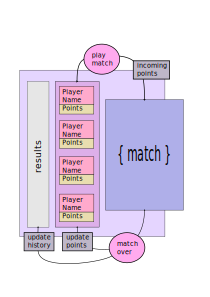

# Deuces

Deuces is a game based on a popular Chinese card game called Big Two (https://en.wikipedia.org/wiki/Big_two).

## Technical Details

Deuces was designed using Object Oriented Programming, and follows a loose implementation of the Observer Pattern by using Redux and RxJS for the game's logic progression and React for the user interface.

The game instantiates with four players (3 AI bots and one Human Player) with 100 points each, and each match updates the number of points each player has, according to the outcome of the match. The losing players each lose a point for each card they have remaining while the winning player wins all those points:

Each match begins with the players being dealt 13 cards

The game's state (match status, cards dealt to players, turns played, etc) is managed using Redux, since functional state change paradigm made it easy to reason about game state transformations. Redux makes it possible to change the game's state in a finite number of ways and the changes are processed through pure function reducers, making code predictable and simpler to manage.

RxJS was used to create observables around the redux store which holds the game/match state. RxJS provided many useful utility methods which made it simple to filter and transform the game state and only expose what needed to be public, or priveleged specific to individual users.
